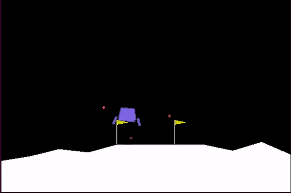

# Introduction  
Implementing various rl algorithms for solving the [LunarLander-v2](https://gym.openai.com/envs/LunarLander-v2/) openai gym
environment. For the time being, there are implementations for:  
1. Monte-Carlo 
2. Sarsa
3. Q-learning
4. DQN

# Training Clips
This one is for mc at around 3000 episodes...  

