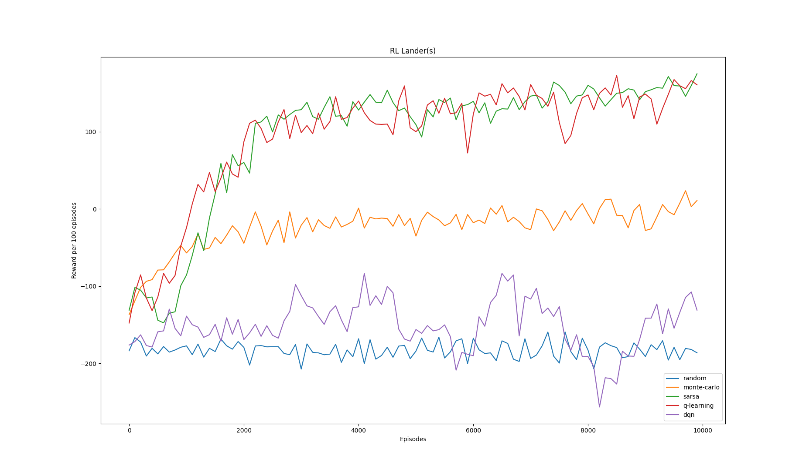

# Introduction  
Attempting to solve the [LunarLander-v2](https://gym.openai.com/envs/LunarLander-v2/) OpenAI Gym
environment. For the time being, there are implementations for:  
1. Monte-Carlo 
2. Sarsa
3. Q-learning
4. DQN

# Training Clips
These training snapshots are captured towards the end of the training phase (~10000 epsiodes). A random agent is also
provided for comparison:  

**Random**  


**Monte-Carlo**  
  


**Sarsa**  
  


**Q-learning**  


**DQN**  


# Experiments
1. `lr=0.1`  
  
2. `lr=0.01`  
  
3. `lr=0.001`  
  

Note that the value of learning rate (equivalently the constant step-size parameter) only affects the performance of Sarsa, Q-learning and DQN. The Monte-Carlo variant implemented here is 
called **Every Visit** Monte-Carlo and it uses a true running average in the policy evaluation step. Subsequently, learning rate does not have any effect on the algorithm's training progress.  
For the 3 experiments conducted above, we compute the average reward for each rl algorithm (averaged across 10000 episodes of training)

|             | Learning rate=0.1 | Learning rate=0.01 | Learning rate=0.001 |
| ---------   | ----------------- | ------------------ | ------------------- |
| Monte-Carlo | -23.134           | **-53.209**        | -44.191             |
| Sarsa       | 95.445            | -55.731            | -182.449            |
| Q-learning  | **95.793**        | -77.473            | -173.590            |
| DQN         | -150.694          | -70.869            | **206.948**         |


# Execution
The purpose of this project is to compare the performance of the rl algorithms implemented. So, for a 
complete comparison, meaning that all of the above agents are trained during program execution, run the
following:

```
python train.py --agents random monte-carlo sarsa q-learning dqn
```
this will train each agent separately using default values, which are
`n_episodes=10000`, `lr=0.001`, `gamma=0.99`, `final_eps=0.01`.  

For a more customized execution, you can explicitly provide the value for each
argument. For example, to only train a dqn agent:

```
python train.py --agents dqn --n_episodes 3000 --lr 0.0001 --gamma 0.99 --final_eps 0.02
```

After training a dqn agent, you can test how well it generalizes using:
```
python autopilot.py <num_episodes> models/*/qnetwork_{*}.pt
```  
To compare dqn to a random agent:
```
python random_agent.py <num_episodes>
```
- [LunarLander-v2/models/pretrained/qnetwork_2000.pt](models/pretrained/qnetwork_2000.pt) lands the lunar lander optimally 95% of the time


# Implementation References  
1. [OpenAI baselines](https://github.com/openai/baselines)
2. [Reinforcement Learning (DQN) Tutorial](https://pytorch.org/tutorials/intermediate/reinforcement_q_learning.html)
3. [Solving The Lunar Lander Problem under Uncertainty using Reinforcement Learning](https://arxiv.org/abs/2011.11850)
